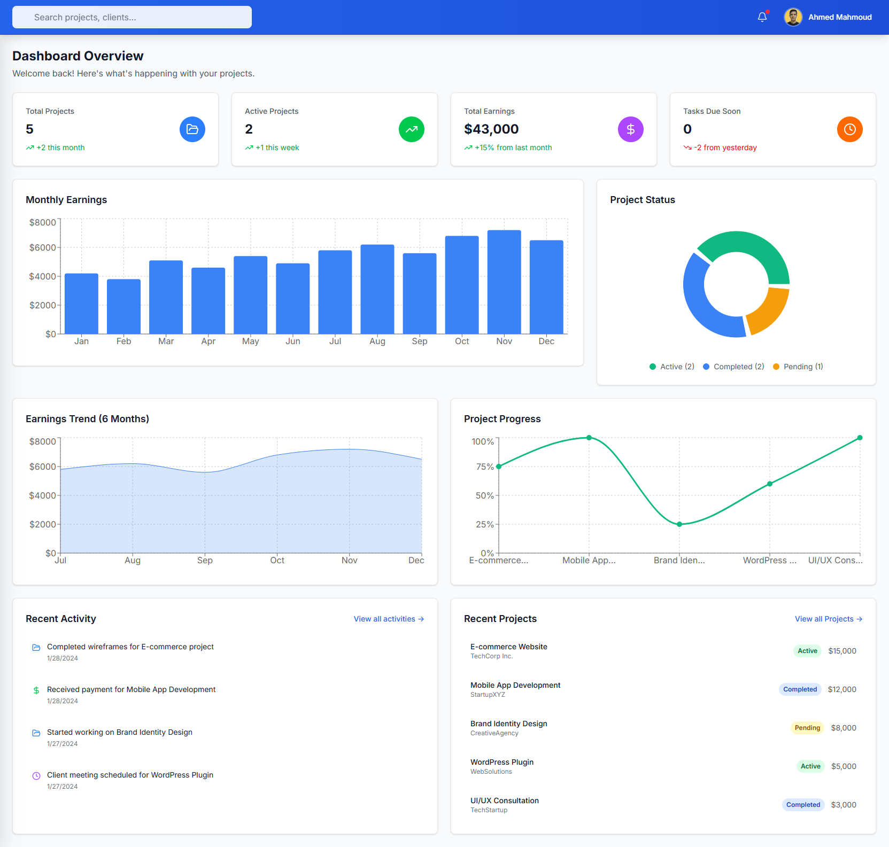
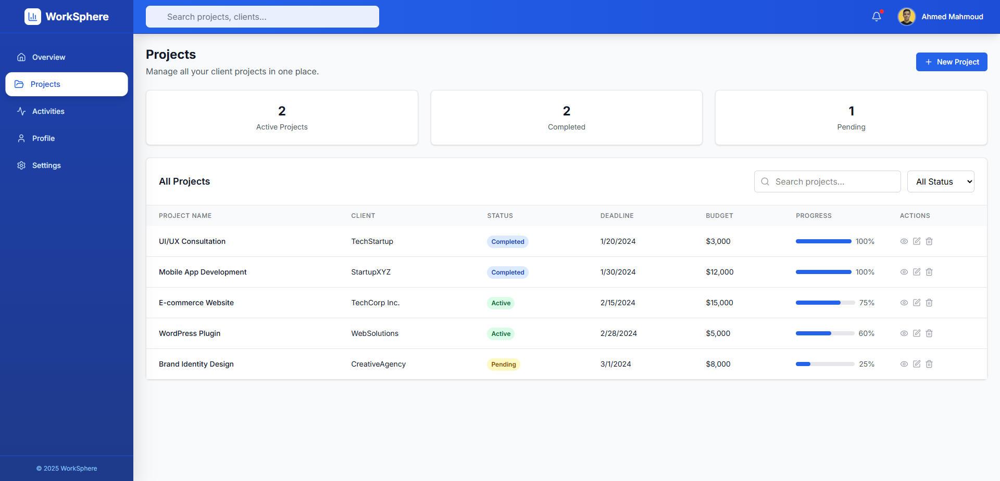
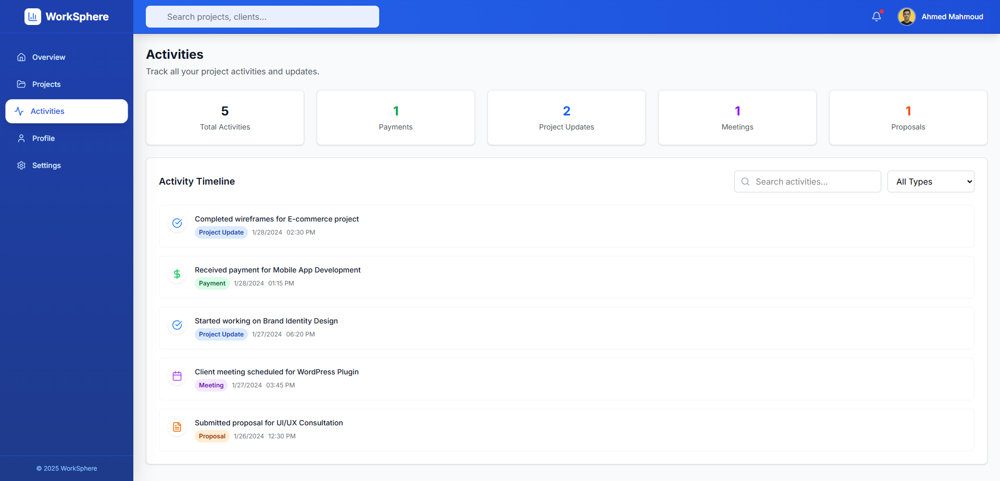
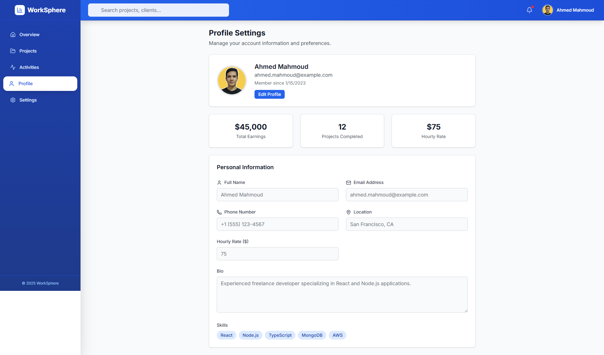

# WorkSphere - Freelancer Dashboard


 

 
 

## 📋 Project Overview

WorkSphere is a comprehensive dashboard application designed for freelancers to manage their projects, track activities, and monitor earnings. Built with modern React technologies, it provides an intuitive interface for project management and productivity tracking.

This project was developed as part of the Elevvo Internship Program - Task 6, focusing on creating a full-featured freelancer management dashboard with advanced UI components and data visualization.

## Features

### Core Functionality
- **Project Management**: Complete CRUD operations (Create, Read, Update, Delete) for projects
- **Activity Tracking**: Timeline view with filtering and search capabilities
- **Earnings Dashboard**: Visual analytics with multiple chart types
- **Responsive Design**: Fully responsive interface that works on all devices
- **User Profile Management**: Profile settings with avatar image support

###  Dashboard Components
- **Overview Page**: Comprehensive analytics with pie charts, line charts, and area charts
- **Projects Page**: Project table with status tracking and budget management
- **Activities Page**: Activity timeline with search and filter functionality
- **Profile Management**: User settings and profile customization

###  UI/UX Features
- **Modern Design**: Clean, professional interface with Tailwind CSS
- **Primary Color Theming**: Consistent blue color scheme throughout the application
- **Interactive Components**: Modal dialogs, dropdown menus, and notification system
- **Icons Integration**: Lucide React icons for consistent visual elements
- **Error Handling**: Graceful fallbacks for image loading and user interactions

## Technology Stack

### Frontend Framework
- **React 19.1.1**: Latest React with modern hooks and component patterns
- **Vite 7.1.2**: Fast build tool and development server
- **React Router DOM 7.8.2**: Client-side routing for single-page application

### Styling & UI
- **Tailwind CSS v4**: Utility-first CSS framework with modern configuration
- **@tailwindcss/vite**: Vite plugin for Tailwind CSS v4 integration
- **Lucide React**: Icon library for consistent UI elements

### Data Visualization
- **Recharts 3.1.2**: Powerful charting library for dashboard analytics
- **Chart Types**: Pie charts, line charts, area charts, and bar charts

### Development Tools
- **ESLint**: Code linting and quality assurance
- **PostCSS**: CSS processing and optimization
- **Vite Development Server**: Hot module replacement and fast development


##  Installation & Setup

### Prerequisites
- Node.js (version 18 or higher)
- npm or yarn package manager

### Installation Steps

```bash
git clone git@github.com:ahmed-226/WorkSphere.git  
cd WorkSphere

npm install

npm run dev

npm run build

```

##  Usage Guide

### Navigation
- **Overview**: Dashboard with earnings analytics and recent activities
- **Projects**: Manage all projects with add, edit, view, and delete functionality
- **Activities**: Timeline view of all activities with search and filtering
- **Profile**: User profile management and settings

### Project Management
1. **Add New Project**: Click the "Add Project" button in the Projects page
2. **View Project Details**: Click the eye icon to view project information
3. **Edit Project**: Click the edit icon to modify project details
4. **Delete Project**: Click the trash icon to remove a project

### Activity Tracking
1. Navigate to the Activities page
2. Use the search bar to find specific activities
3. Filter activities by type (All, Development, Design, Meeting, Review)
4. View detailed activity timeline with timestamps

### Dashboard Analytics
- View earnings trends with interactive charts
- Monitor project progress and completion rates
- Track recent activities and notifications
- Analyze performance metrics


## Internship Learning Objectives

This project demonstrates proficiency in:

1. **React Development**: Modern React patterns with hooks and functional components
2. **State Management**: Component state and data flow management
3. **UI/UX Design**: Creating intuitive user interfaces with modern design principles
4. **Data Visualization**: Implementing charts and analytics dashboards
5. **Responsive Design**: Building applications that work across all devices
6. **Project Structure**: Organizing code with proper component hierarchy
7. **Error Handling**: Implementing robust error handling and user feedback
8. **Modern Tooling**: Using Vite, Tailwind CSS, and modern development tools


---

*This project represents the culmination of skills learned during the Elevvo Internship Program.
